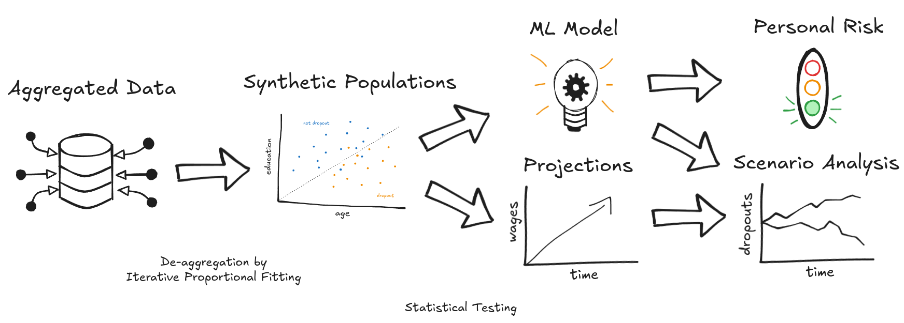

# **FinApprenticeship: Strengthening Vocational Education Through Data-Driven Decisions**

For decades, apprenticeship dropout rates have been steadily increasing in Germany. To better understand the factors driving this trend—and to provide actionable insights for students and policymakers—**FinApprenticeship** has compiled a comprehensive dataset from **DAZUBI** and **Gestatis**, covering the years **2013 to 2023**. This dataset includes information on apprenticeship contracts, labor market trends, and economic indicators at the federal state level.

## **Our Approach**

Due to the lack of individual-level data, we employed **iterative proportional fitting** to construct a **synthetic population** that mirrors the characteristics of real apprentices. This synthetic population served as the foundation for training a **machine learning (ML)** model.

The ML algorithm predicts the likelihood of an individual—based on their demographics and the job market and economic conditions of their federal state—**prematurely terminating** their apprenticeship.

## **Scenario Analysis and Forecasting**

Building on the synthetic population, we projected the future development of key variables (e.g., education levels, demographic shifts). For a more nuanced **scenario analysis**, we altered these projections to simulate the potential effects of **policy interventions** on different indicators of apprenticeship success.

We then used our trained ML model to analyze these simulated futures and estimate **dropout rates** under each scenario.

*Figure: Overview of the FinApprenticeship workflow. Aggregated data is de-aggregated via Iterative Proportional Fitting to create synthetic populations. These are used to train a machine learning model, generate projections, estimate personal dropout risks, and evaluate the impact of policy changes through scenario analysis.*

## **Integrated Dashboard**

We developed an **interactive dashboard** to make our insights accessible and actionable. The dashboard includes:

- **Historical data exploration**: Explore key trends and patterns across time and regions  
- **Dropout risk assessment**: Estimate the dropout risk for prospective apprentices based on their background  
- **Scenario simulation results**: Visualize the potential impact of different policies on dropout rates

---

**FinApprenticeship** empowers stakeholders with data-driven insights to **strengthen vocational education and reduce dropout rates** across Germany.